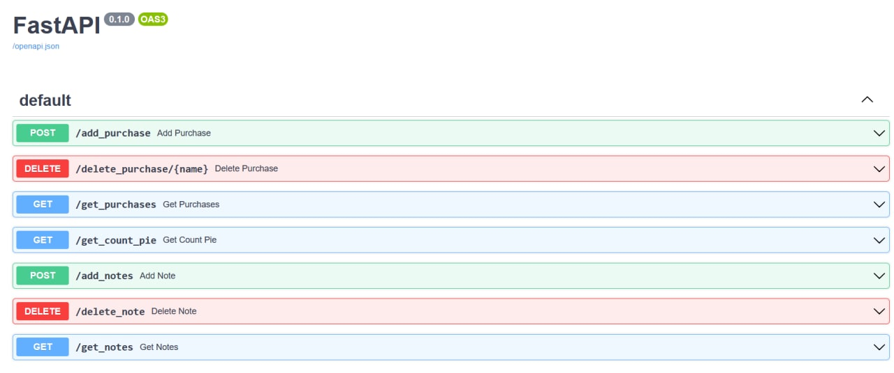

# API для сохранения заметок и покупок



### **Стек**
- FastAPI
- sqlalchemy
- alembic
- pytest

### **Описание**
Это приложение позволяет вести **дневник расходов** и получать отчёты на разных промежутках времени, а так же **сохранять заметки** с использованием тегов. 

Все «ручки» описаны в файле [description.yaml](https://github.com/Maksim-Burtsev/purchases_api/blob/master/description.yaml).

Основной задачей при создании данного проекта было знакоство с FastAPI и технологиями, которые чаще всего идут «бок о бок» с ним. 

### **Что было сделано**

1. Создал простые модели с помощью **sqlalchemy**
2. Выполнил миграции с помощью **alembic**
3. Реализовал стандартные CRUD'ы
4. Для «ручек» с отчётами выполнил запросы с группировкой и аггрегацией
5. Есть «ручка» которая возвращает *.jpeg* После того, как картинка успешно доставлена пользователю, она удаляется с помощью **background tasks** (которые идут из коробки)
6. Для генерации диаграммы с отчётом использовал **matplotlib** (с последующим сохранением результата)
7. Протестировал всё с помощью **pytest**


### **Запуск**
``` make run ```

### **Запуск тестов**

``` make test ``` 

или

``` pytest ```